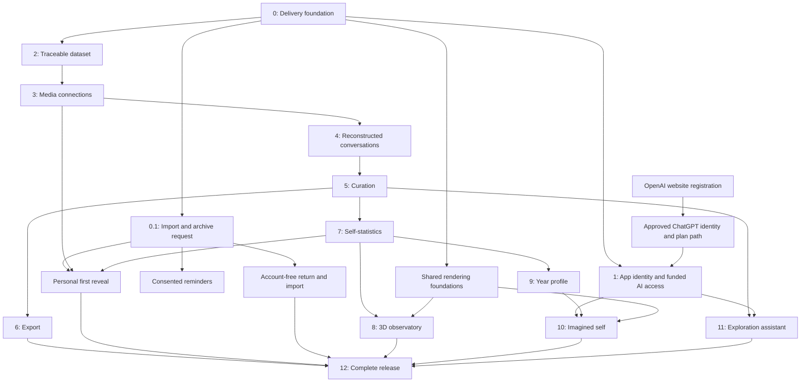

# Goodbye Chat masterplan

## The product

Goodbye Chat turns a Snapchat export into a connected, explorable account of a person's life: conversations with their photos and videos in place, a collection they can curate and take elsewhere, and a beautiful way to understand their own history. Its signature experience is choosing a year and talking with an imagined version of themselves, grounded in how they actually wrote during that period.

This is a hobby project and an experiment in agentic software development. It should become a complete, distinctive product while giving us concrete evidence of what agents can implement, verify, and operate independently.

## Commitments

1. **Reconstruct the human experience.** A conversation includes its available text, media, participants, and chronology. The owner should recognize the conversation they remember.
2. **Make curation useful.** The owner can find, exclude, keep, and export things with confidence. Their original export stays intact.
3. **Make the data understandable.** Every statistic has a plain-language explanation, a defined scope, and a way to inspect the evidence.
4. **Make the experience spectacular.** Desktop is the design target. Three.js, WebGPU, spatial navigation, carefully composed scenes, sound where appropriate, and expressive motion are part of the product. Mobile work is out of scope.
5. **Support genuine account identity and user-funded AI.** Initial app identity uses WorkOS AuthKit, with a separate OpenRouter connection. Genuine ChatGPT sign-in remains a desired path with its own provider registration gate. Identity, AI allowance, and permission to send archive material are independent controls.
6. **Keep the archive private.** Importing, browsing, reconstruction, curation, ordinary statistics, and local exports work on the owner's device. AI features disclose and minimize any material that leaves it.
7. **Keep evidence and imagination identifiable.** Missing content remains missing. A guessed media association stays a guess. The imagined self is a fictional interpretation with visible grounding.
8. **Make delivery agentic.** Agents own implementation, technical review, tests, deployment verification, and maintenance. The user sets direction and judges the running experience.
9. **Do not subsidize production inference.** Paid requests use the connected user's authorized allowance. A development key cannot become a shared production funding source.

The glossary is in [CONTEXT.md](CONTEXT.md). Authentication and AI access follow [auth.md](auth.md). The rendering and AI scene contracts are in [docs/visualization.md](docs/visualization.md). Onboarding and return reminders follow [docs/onboarding.md](docs/onboarding.md); portable bundles and external transfers follow [docs/export-destinations.md](docs/export-destinations.md). This plan defines the product and its delivery gates. Keep completed outcomes and open tasks in [progress](.notes/progress.md), future-session ideas in [the backlog](.notes/backlog.md), and transient experiments outside durable documentation.

## Authentication, funding, and agent-native operations

The initial identity provider is WorkOS AuthKit. Its managed account/session capabilities and documented CLI/API operations fit this project's goal of independent agent implementation and operation. The implementation will use its supported Node backend flow with the existing Vue interface. Recheck current core pricing and quotas before provisioning production; paid add-ons and automatic paid upgrades need the owner's explicit agreement. [AuthKit integration](https://workos.com/docs/authkit/vanilla/nodejs), [agent-oriented CLI](https://workos.com/docs/authkit/cli-installer), [current pricing](https://workos.com/pricing).

For the initial AI path, an authenticated owner connects OpenRouter through its supported PKCE flow. The resulting user-controlled key funds requests through its connected account. This is a provider connection, with its own authorization and billing metadata; it does not replace verified app identity. OpenRouter documents the public website callback flow without the hosted ChatGPT registration requirement. [OpenRouter connection](https://openrouter.ai/docs/guides/overview/auth/oauth).

Funding rules:

- Local import, reconstruction, curation, statistics, rendering, and exports require no paid model request.
- Each AI request uses the initiating account's active connection. Missing credits or authorization leaves local features working and pauses inference.
- Check the connected key's finite allowance and remaining limit. Show provider-reported allowance honestly; an ordinary connection does not necessarily expose the entire account balance.
- Use bounded context, output limits, concurrency limits, cancellation, and explicit usage reporting. Estimates are labelled estimates.
- Do not claim that an app setting changes a provider's spending cap. Verify a supported cap or direct the owner to the provider's dedicated-key controls.
- Stop on depleted, disconnected, or revoked access. Do not silently choose another account, key, paid model, or billing path.
- Keep development credentials, synthetic evaluation budgets, and production user connections separate. No automatic paid evaluation runs.
- The initial product does not collect AI payments itself. Users buy their own provider credits or use an approved plan allowance. App-operated subscriptions or prepaid credits would need a separate financial and entitlement design.

Agent-native means repeatable CLI/API configuration, typed SDK contracts, machine-readable errors, synthetic testing, and a verified deployed outcome. The app should also support scoped, revocable agent access through an implemented registration contract such as the open auth.md protocol. Publishing instructions alone does not create that contract. Provider approvals, a person's sign-in/consent, and acceptance of paid terms remain explicit external boundaries. [auth.md protocol](https://workos.com/auth-md).

## Who this is for

These are fictional personas used to judge product decisions.

**Nora, the deliberate curator.** Nora wants to leave Snapchat while keeping the parts of her life that matter. She has years of media, some people she would rather leave behind, and little patience for technical export formats. She needs clear selection, reversible decisions, and an export she can trust. Her successful visit ends with a useful collection saved somewhere she controls.

**Alex, the curious time traveller.** Alex enjoys rediscovering old jokes, friendships, and phases of life. A photo becomes much more interesting when its surrounding conversation is visible. Alex wants to move between years, see how language changed, and try speaking with an imagined past self. The experience should feel personal and surprising, with evidence close at hand.

**Sam, the visual learner.** Sam has never analysed a dataset. Questions such as "Who did I talk with most that year?" and "Why does this chart look different?" are more natural than choosing an aggregation. Sam needs guided questions, readable explanations, consistent filters, and visuals that make a relationship easier to understand. Each scene should teach something without requiring a tutorial in statistics.

We also judge our engineering process as an agentic development experiment. We record which outcomes were achieved, what was independently verified, which interventions were needed, and which limitations came from the model, tools, missing data, or external access.

## The finished journey

1. A visitor can open their own archive immediately or follow the official request instructions. Every workspace uses the owner’s imported records.
2. A visitor without an archive follows the official Snapchat My Data request flow. Goodbye Chat explains the wait and how Snapchat will notify them, without collecting their Snapchat password or download link.
3. While waiting, they can review their request checklist and optionally arrange a consented email reminder. Returning with the files works without an account; account features and reminders have their own permissions.
4. The owner downloads the export from Snapchat and selects its original ZIPs locally. A spatial import sequence reveals real indexing, linking, and analysis progress as each stage completes.
5. The app explains coverage and offers a private first reveal: an old photo, a surprising scoped statistic, a recorded participant connection, or an opt-in rediscovery of the owner's own embarrassing words. Every highlight opens its evidence and can be skipped or hidden.
6. The owner chooses a starting route: rediscover and have fun, understand their history, or curate and take their data elsewhere. All routes enter the same workspace and preserve the current selection.
7. The owner opens a conversation and sees text alongside the images, clips, stickers, and other media the export can associate with it. Selecting media reveals its known conversation context; selecting an event reveals the asset and any overlay.
8. The owner filters by year, person, conversation, content, or media type, then keeps, excludes, or postpones review of items. Those decisions feed an explicit curated collection across every room.
9. The observatory explains patterns and lets the owner move through a timeline, inspect an observed relationship, or explore changing vocabulary.
10. The owner can download a complete supported archive bundle or a curated bundle, including chosen media with composited overlays and readable conversations. Separate, explicit transfers can send supported selected media to Google Photos or the owner's Immich instance.
11. The owner signs in when they want account features and connects their own AI allowance. Approved ChatGPT sign-in and plan use can become another supported path; AI access always has its own permission and usage state.
12. The owner chooses a year, reviews the available evidence and proposed language profile, and approves the material used for an imagined self. A year room opens with a stylized, expressive presence informed by that year's writing.
13. Recorded memories, interpretations, and generated conversation remain distinguishable. The owner can change the evidence, undo curation, stop AI use, cancel reminders or transfers, clear local working data, and take their collection with them.

The first working slice will be small. The completed journey should feel like one product, with a shared selection and history connecting all of its rooms.

## Product spaces

| Space | Purpose | Essential connections |
| --- | --- | --- |
| Arrival and waiting room | Make the promise tangible, guide the export request, and help the visitor return. | Official request flow, consented reminders, local import. |
| Import desk | Establish what evidence is available and open a private workspace. | Original archive, coverage, diagnostics. |
| First reveal | Offer evidence-based personal highlights and a choice of starting route. | Available media, scoped observations, participant context, hide/skip controls. |
| Conversations | Reconstruct exchanges with their media in context. | Participants, events, asset links, dates. |
| Library | Browse and curate all available media and other reviewable items. | Conversation context, filters, decisions, export. |
| Observatory | Explain history through questions, measurements, and spatial scenes. | Shared collection, observations, source events. |
| Year room | Build a year profile and talk with its imagined self. | Owner-authored evidence, consent, AI usage, memory references. |

Navigation should preserve the current year, selected participant, and review context when that helps the owner continue a task. A scene can focus attention on a period or relationship without losing the ability to open its underlying conversation.

## Starting point

The repository has browser ZIP import, multipart indexing, parsers for several history files, local media resolution, a basic Memories browser, year/type filters, and foundations for statistics. Build, unit, and browser checks exist. Import failure and retry, replacement of an archive, and route protection have been exercised.

The guided request-and-return journey, personal first reveal, connected conversation reconstruction, complete bundles and destination integrations, a user-facing observatory, genuine ChatGPT authentication, and the imagined-self experience still need delivery. Marketing examples and type definitions do not establish that these features work.

The existing Vue/Vite application remains the foundation. Hosting is moving to Vercel. A hosting move does not by itself provide authentication, a database, AI entitlement, or a 3D engine.

## Order of delivery

Each phase produces a working outcome with an exit gate. We use small vertical slices within phases: a real interaction, its data path, its failure states, and its verification. A phase can have several iterations; a successful demonstration of one fixture does not complete the whole phase.

The detailed acceptance criteria for every phase are indexed in [specs/README.md](.notes/specs/README.md). Delivery follows an implementation, independent review, correction, and re-review loop against those criteria. The manager checks the connected product journey before accepting a slice. External registration and production verification remain separate gates, so local archive work continues while they are pending.

| Phase | Outcome | Depends on |
| --- | --- | --- |
| 0 | A dependable delivery and testing foundation. | Existing app and deployment access. |
| 0.1 | Compelling onboarding, a truthful wait-and-return path, and the first personal reveal. | Phase 0 for the request/import path; Phase 1 for account-bound reminders; Phases 2, 3, and 7 for real highlights. |
| 1 | App identity, user-funded OpenRouter access, and the approved ChatGPT path. | Phase 0, AuthKit access, and provider credentials; ChatGPT also needs OpenAI registration. |
| 2 | A normalized, traceable dataset with explicit coverage. | Phase 0. |
| 3 | Evidence-based connections between events, media, and overlays. | Phase 2. |
| 4 | Reconstructed conversations people can actually browse. | Phases 2–3. |
| 5 | Unified search, filtering, and reversible curation. | Phases 2–4. |
| 6 | Complete and curated portable bundles, plus supported Google Photos and Immich transfers. | Phase 5, resolved media policy, and each destination's access requirements. |
| 7 | Understandable, inspectable self-statistics. | Phases 2 and 5. |
| 8 | A connected Three.js/WebGPU observatory. | Phase 7; build rendering foundations earlier. |
| 9 | Evidence-backed profiles of the owner's language by year. | Phases 2, 5, and 7; AI enrichment also needs approved access. |
| 10 | An imagined self in an immersive year room. | Phases 1 and 9, the user's funded inference connection, and rendering foundations. |
| 11 | An assistant that can help explore and curate safely. | Stable query/curation contracts and approved AI access. |
| 12 | A coherent release, operational checks, and user discovery. | Completed core journeys and verified deployment. |

App authentication, the user-funded OpenRouter path, and the first onboarding slice are immediate priorities. Build real archive import and request instructions early; add personal highlights as their data contracts become reliable. The optional provider permission to use a ChatGPT plan is tracked independently. Data reconstruction continues while external registrations are pending, because those tasks do not depend on an AI service.

## Phase 0. Delivery, privacy, and stability

**Owner-visible outcome:** the app opens reliably, handles an imperfect import honestly, and recovers without stale data or a broken page.

Work:

- Establish repeatable local setup, build, unit checks, browser verification, and deployment verification using pnpm.
- Validate environment configuration through Varlock, default values to sensitive, keep secrets out of client bundles, and keep local credential files outside version control.
- Keep private archives and every private derivative out of commits, deployment uploads, public examples, and external AI tests.
- Use synthetic archives for repeatable parser cases, malformed inputs, visual evidence, and CI.
- Maintain clear archive-session lifecycle: cancellation, replacement, reset, closing readers, and revoking media URLs.
- Handle missing files, malformed JSON, duplicate paths, unexpected content, unsupported formats, and decompression/resource limits.
- Show progress that corresponds to actual work. Keep the interface responsive while indexing and analysing.
- Verify document routes and hashed assets on the deployed host. Detect stale HTML referencing missing JavaScript.
- Establish preview and production checks, a known rollback path, and minimal operational evidence that contains no archive content.
- Follow the release review rule in [agents.md](agents.md) and satisfy the required branch protections before merging.
- Exercise desktop navigation, browser reloads, interrupted operations, error recovery, and relevant browser capability failures.

**Exit gate:** a clean checkout can pass the required checks; a deployed release opens directly on its important routes; a valid synthetic multipart import works; a damaged import offers a working retry; replacing or clearing an archive leaves no previous data visible. The agent can identify the deployed revision and demonstrate its affected journey.

## Phase 0.1. Arrival, waiting, and the first reveal

**Owner-visible outcome:** the visitor understands how to request their archive and returns to an import that reveals something personal before asking them to navigate a large dataset.

This work spans the later data phases. Its detailed states, notification boundaries, and verification contract are in [docs/onboarding.md](docs/onboarding.md). The first slice needs no archive, AI request, or destination account.

Work:

- Offer immediate local import and official archive request instructions. Build connected conversations, media and observations against imported owner records.
- Link to Snapchat's official My Data request page and explain choosing the desired date range and media options. State the current documented delivery expectation without guaranteeing a deadline.
- Treat departure to Snapchat and return to Goodbye Chat as explicit states. A visitor can mark the request sent, keep a request checklist, and return when their download arrives.
- Offer optional reminders with verified recipient ownership and specific consent. Durable waiting must survive process restarts, stop on cancellation/import/account deletion, and bound retries and total sends.
- A timer sends a truthful reminder to check Snapchat, not a claim that the archive is ready. Add readiness callbacks only after establishing a supported provider contract and authenticating its events.
- Keep reminder records separate from the archive. Emails and return URLs contain no photos, names of participants, message excerpts, Snapchat download tokens, or private highlights.
- Use local workers and measured stages for indexing, inventory, media links, and statistics. Let a 3D scene build as evidence arrives; support cancellation, retry, reduced motion, and immediate access when analysis is complete.
- Choose highlights from available, traceable evidence. Start with local counts and retrieval; remote AI is an optional, separately consented enrichment funded by the user.
- Make embarrassing-message rediscovery opt-in and limited to verified owner-authored text. Offer skip/hide controls and avoid judging a participant's personality or a relationship's quality.
- Offer rediscovery, self-analysis, and curation/export routes that preserve the same collection and allow switching without another import.

**Early exit gate:** a new visitor can open local import or reach the genuine Snapchat request page, understand the waiting state, and return to import. A synthetic reminder flow survives restart and repeated delivery attempts, sends within its consented limit, and stops after cancellation or import.

**Personal reveal exit gate:** a synthetic archive produces independently verified highlights with working evidence links; sparse or missing data produces an honest alternative; skip/hide choices hold across routes. Browser checks show real progress and cancellation, local-only analysis, and no archive content in notification traffic. Waiting and arrival alone do not complete this phase.

## Phase 1. Account identity and user-funded AI

**Owner-visible outcome:** a supported login establishes a real account session, and connecting an AI allowance enables paid features under that account's authorization. The interface clearly identifies the funding source and whether inference is available.

Deliver this in two tracks. First, implement WorkOS AuthKit and the user's OpenRouter connection using the supported contracts in [auth.md](auth.md). Second, obtain registration for genuine hosted ChatGPT sign-in and any separate plan-sharing permission. OpenAI documents a hosted OAuth/OIDC integration requiring a provisioned application client and approved callbacks; its open-source dynamic registration uses a local `127.0.0.1` listener. A public repository does not establish hosted registration. [Website integration](https://developers.openai.com/siwc/website), [open-source registration](https://developers.openai.com/siwc/token-sharing-open-source/sign-in).

Work:

- Configure AuthKit through its supported SDK and management interfaces, with distinct development, preview, and production callback environments.
- Add a separately authorized OpenRouter connection bound to the verified app account. Protect the user's credential and verify its allowance before enabling paid inference.
- Obtain the supported ChatGPT website registration and implement that identity path when its prerequisites are met.
- Implement the authentication transaction, callback, verified identity, first-party session, and logout contract in [auth.md](auth.md).
- Keep browser components unaware of credentials and token exchange details. Use a same-origin backend boundary.
- Persist short-lived OAuth transactions and application sessions in a durable store suitable for multiple function instances.
- Request the smallest supported identity scope. Verify actual granted permissions before exposing account capabilities.
- Model signed-out, signing-in, signed-in, declined, expired-session, unavailable-provider, and revoked-access states.
- Separate basic identity from permission to use a ChatGPT plan. Keep browsing and local exports available without signing in.
- Give inference access its own availability, usage, limit, and recovery states. Never silently change who pays for a request.
- Keep login data separate from archive files and their contents.
- Implement scoped, revocable agent registration/access with real authorization endpoints before publishing a public auth.md protocol document. Agent access cannot invent an identity, inherit paid allowance automatically, or bypass archive consent.
- Verify server-side ownership, callback replay prevention, account isolation, and logout behavior.

**Initial exit gate:** a real AuthKit account can sign in on the deployed site, remain signed in after reload, connect its own funded OpenRouter key, make an explicitly authorized synthetic request, disconnect, and sign out. Invalid or replayed callbacks are rejected; account isolation and depleted-allowance states work. Synthetic provider tests pass.

**ChatGPT completion gate:** a real approved account completes the supported ChatGPT website sign-in. Plan usage has a separate gate: an authorized synthetic request finishes through that account's granted ChatGPT allowance. Success through OpenRouter does not establish either ChatGPT capability.

**When ChatGPT access is pending:** prepare and test the implementation with a synthetic identity provider, record the exact missing registration, and continue through the AuthKit/OpenRouter and local product paths. Do not expose a button that pretends to provide working ChatGPT login. A local companion is a possible separately agreed distribution path, with its own installation and security work.

## Phase 2. A trustworthy dataset

**Owner-visible outcome:** the app explains what their export contains and gives every displayed item a traceable source.

Work:

- Define normalized participants, conversations, events, assets, source references, links, review decisions, and observations using the shared glossary.
- Retain original values where interpretation can lose meaning: timestamps, sender fields, identifiers, captions, and source occurrences.
- Distinguish the archive owner from every other participant. Prove authorship before including text in an imagined-self profile.
- Establish stable item identities and a dataset fingerprint that supports repeatable review decisions without sending it to a server.
- Normalize time explicitly: source timestamp, precision, timezone, display time, and the timezone used by year filters.
- Preserve stable ordering when timestamps tie. Explain absent or invalid time information.
- Identify exact duplicate records separately from genuine repeated messages or repeated uses of the same asset.
- Build an inventory of metadata records, physical assets, supported types, unmatched items, and incomplete sections.
- Preserve unsupported records as inspectable evidence where possible; avoid silently losing them in permissive parsers.
- Index and query in browser workers. Read and decode large media on demand.
- Make coverage part of every later result. A missing month or missing file category is an unknown, rather than proof of inactivity.

**Exit gate:** synthetic datasets with split ZIPs, tied times, missing fields, duplicates, group conversations, ambiguous names, and invalid records produce reproducible results with source references. Re-importing the same supported evidence produces stable identities and consistent coverage.

## Phase 3. Connect media, messages, and overlays

**Owner-visible outcome:** selecting a conversation event can reveal its media, and selecting a media item can reveal the conversations in which it appears.

Work:

- Resolve explicit media identifiers against indexed archive files before considering weaker associations.
- Support one event with several assets and one asset occurring in several events.
- Preserve separate asset occurrences and distinguish an identical file from an identical event.
- Associate original images/videos with their separate overlay layers using documented evidence in the export.
- Define four relationship states: confirmed, inferred, ambiguous, and unlinked. Store the basis for each association.
- Keep time proximity as a candidate-generation signal. It cannot independently prove who received a photo.
- Show unresolved candidates in a reviewable resolver instead of choosing silently.
- Allow the owner to confirm or reject a proposed association without rewriting source records.
- Render missing-media placeholders with available context. Retain existing metadata even when the physical file is absent.
- Keep every expired remote media URL outside the browsing data path. Read archive assets locally.
- Compare composed media against its layers and preserve originals for export choices.

**Exit gate:** exact-match fixtures link correctly; ambiguous fixtures remain ambiguous; missing identifiers and files never attach an unrelated asset. A composed image shows its overlay in the correct position. Every relationship can explain its evidence and survive moving between views.

## Phase 4. Reconstruct the conversations

**Owner-visible outcome:** a chat with a person feels like an exchange, with its available media in the right place.

Work:

- Build a searchable conversation list with participants, available date range, and useful previews.
- Implement chronological message grouping, sender alignment, day separators, and clear time information.
- Render supported text, images, videos, audio, stickers, GIFs, attachments, and recorded system events.
- Open media inline and in a focused viewer while preserving the event's context.
- Support direct and group conversations without merging unrelated participants who share a display name.
- Jump to a date, year, search result, or specific event and load nearby context.
- Virtualize long threads and decode only the media needed for the current view.
- Handle absent text, missing files, incomplete histories, and uncertain links with understandable states.
- Provide source inspection as a secondary action for curious owners and verification.
- Keep text rendering safe when archive content contains markup, links, or instructions.

**Exit gate:** a synthetic conversation with text, an image and overlay, a clip, repeated media, and missing content displays in a stable order. Searching or selecting a library item opens the corresponding event. A long thread remains responsive and preserves navigation context.

## Phase 5. Search, filters, and reversible curation

**Owner-visible outcome:** the owner can go through their history, keep what matters, exclude what they dislike, and understand the resulting collection.

Work:

- Define one shared query contract across the library, conversations, statistics, export, and year-profile tools.
- Combine time range/year, participant, conversation, media type, archive section, text search, link state, and review status.
- Include both Memories and supported chat media in the library, with clear source context.
- Show active filters, result counts, and understandable empty states. Make a reset available.
- Support keep, exclude, and review-later decisions for individual items and explicitly scoped groups.
- Define how excluding a participant affects group conversations and shared media; preview the effect before applying it.
- Keep decisions separate from source records. Support undo, redo, and review of earlier choices.
- Provide an undoable batch workflow with a selection summary before large changes.
- Recompute the effective collection after each decision. Keep preview counts consistent across rooms.
- Offer local saving of review state with an explicit persistence choice. Handle storage quota and missing permission.
- Make re-import restoration deterministic. Warn when a saved review state belongs to different evidence.

**Exit gate:** the owner can choose a year, exclude a person or item, inspect the exact effect, undo it, and obtain the same selection in the library, export preview, statistics, and persona evidence. No decision modifies the original ZIPs.

## Phase 6. Export something worth keeping

**Owner-visible outcome:** the owner can download their supported archive or a curated collection with media and overlays together, and deliberately transfer supported media to Google Photos or their own Immich instance.

Bundle policy and destination-specific capability gates follow [docs/export-destinations.md](docs/export-destinations.md). A media destination cannot replace a complete bundle of conversations, evidence, and original files.

Work:

- Build an export preview with date range, item counts, estimated size, missing assets, unresolved links, and inclusion policy.
- Offer distinct complete supported archive and curated collection modes. Preview the scope explicitly; a complete mode requires a deliberate choice if it would include previously excluded items.
- Offer preserved original assets and clearly identified composed image/video variants with supported overlays, captions, drawings, and stickers. Verify alignment, orientation, alpha, dimensions, and supported video timing; report unsupported cases rather than dropping a layer.
- Include a manifest describing selected items, timestamps, conversation context, review policy, missing content, checksums, and the relationship between originals and derivatives. Retain the original archive as a separate unchanged source.
- Use collision-safe, portable filenames and safe output paths. Preserve Unicode meaning without creating unsafe paths.
- Define metadata policy explicitly. Original-file exports may retain embedded GPS and other metadata; privacy-preserving variants require deliberate transformation and disclosure.
- Export text conversations in a readable format with their selected local media references, alongside machine-readable context.
- Stream or split large bundles where browser capabilities allow. Support progress, cancellation, and bounded memory use.
- Explain unsupported transformations and missing items before completion.
- Verify original-file bytes with checksums and compare bundle contents with the approved selection.
- Implement Google Photos as an explicitly scoped export of supported media, with current OAuth permission and app-created-library restrictions accounted for. Do not promise unrestricted browsing or synchronization of the owner's existing library.
- Implement Immich transfer to the owner's verified destination with least-privilege access and an explicit connection path for privately hosted instances. A cloud function cannot assume access to a home network; use the supported local connector path where necessary.
- Show the account/instance, collection, media variants, metadata, estimated transfer size, and unsupported items before any external transfer. Authentication and curation do not grant transfer permission.
- Persist a minimal private transfer ledger to resume safely, reconcile actual destination results, avoid duplicate uploads, and distinguish success, missing items, cancellation, and partial failure. Recheck destination access before retrying.
- Verify destination results using synthetic media and scoped test accounts. Revoke connections cleanly and keep credentials and private destination addresses out of public logs.

**Bundle exit gate:** complete and curated synthetic collections round-trip into bundles with expected assets and context; exclusions match the approved policy; filenames do not collide; originals retain their bytes; composed variants retain supported overlays; cancelling does not leave a falsely completed export. A realistic private export is verified locally without publishing its content.

**Destination exit gate:** an explicitly approved synthetic selection arrives in the correct Google Photos account and an owner-controlled Immich instance with supported dates and variants. Repeating an interrupted transfer does not duplicate confirmed items; expired access, unsupported media, unreachable instances, cancellation, and partial failure produce accurate results. Neither transfer success nor a photo count proves that the complete archive was preserved.

## Phase 7. Statistics people can understand

**Owner-visible outcome:** the owner can answer questions about themselves and their history without knowing how data analysis works.

Initial questions:

- When was I active in the history this archive contains?
- Who did I exchange the most recorded messages with in a chosen period?
- How did my own writing change across years or conversations?
- What proportion of this collection is text, photos, video, or other media?
- Which periods and relationships are poorly represented in this export?
- What changes when I apply my curation decisions?

Work:

- Compute counts, time distributions, word/emoji frequencies, media distributions, and supported relationship observations locally.
- Distinguish messages authored by the owner from messages received from others.
- Define each metric's unit, denominator, timeframe, source category, timezone, and coverage.
- Label an observed run of chat-active days accurately. An export-derived proxy cannot establish an official Snapchat streak.
- Introduce normalized comparisons where periods have different lengths or available evidence.
- Build guided question cards, plain explanations, and drill-down actions that open the relevant items.
- Treat vocabulary changes and any tone estimates as scoped observations or interpretations, with limitations visible.
- Keep personality, relationship quality, and mental-health claims outside deterministic counts.
- Provide a synchronized reading view with exact values and an explanation of visual encodings.
- Cache reproducible results by dataset, query, and analysis version; invalidate them when relevant decisions change.

**Exit gate:** fixture-derived observations match independent expected values. A non-specialist can explain what a chosen visualization measures, why its filters change the result, and which source items support it. Sparse or missing history receives a coverage explanation.

## Phase 8. The immersive observatory

**Owner-visible outcome:** their history becomes a navigable world whose visual relationships mean something.

OpenAI documents interactive visualizations and generated 3D browser experiences. We will use those coding and reasoning capabilities to build the experience, with Three.js rendering scenes on the owner's device. The reviewed API documentation does not establish native mesh/GLB generation; the rendering design uses reproducible assets and validated scene descriptions. [Interactive visualizations](https://learn.chatgpt.com/docs/visualizations), [3D showcase](https://developers.openai.com/showcase/physics-museum), [rendering contract](docs/visualization.md).

Scenes:

| Scene | Experience | Data meaning |
| --- | --- | --- |
| Timeline landscape | Travel through years, months, and bursts of recorded activity. | Time, observed activity, and coverage. |
| Relationship constellation | Select a person or conversation and inspect its surrounding history. | Defined interaction counts and temporal connections. |
| Memory gallery | Move through an arranged collection of photos and clips. | Curated selection with conversation links. |
| Language landscape | Explore changing words, phrases, and emoji across periods. | Owner-authored frequencies and supported comparisons. |
| Map room | Revisit places represented in the export. | Available recorded locations with their precision and gaps. |

Work:

- Define a coherent art direction: typography, lighting, materials, camera grammar, transitions, and sound policy.
- Build Three.js rendering behind a small scene contract, using WebGPU where available and a verified desktop fallback.
- Tie geometry, size, connections, and labels to defined data. Explain encodings close to the view.
- Link scene selections to the shared collection and source inspector. A click can open a conversation or media detail.
- Generate and validate bounded scene descriptions; keep numeric observations under deterministic local control.
- Use instancing, level of detail, aggregation, culling, bounded textures, and on-demand media decoding.
- Define performance budgets against recorded desktop benchmark scenarios. Measure frame time, memory, interaction delay, and scene transition cost.
- Support resize, reduced motion, keyboard selection, GPU/device loss, and a synchronized reading mode.
- Keep geospatial processing local where possible; external map requests need an explicit privacy design.
- Use licensed, reproducible assets and synthetic data for screenshots and visual regression checks.

**Exit gate:** the scenes are visually distinct and connected, selections open correct evidence, large synthetic histories meet measured desktop budgets, and GPU failure recovers into a usable view. The owner can tell what a visual relationship means. Visual flair never changes the underlying statistic.

## Phase 9. Understand how I wrote in a chosen year

**Owner-visible outcome:** a year profile explains the language evidence that will shape the imagined self.

Work:

- Select a year using the workspace's explicit timezone and the owner's effective curated collection.
- Include only proven owner-authored text by default. Keep quoted messages and uncertain authorship identifiable.
- Measure message length, punctuation, capitalization, emoji, common words/phrases, language mix, and variations by conversation context.
- Record message counts, active periods, sampling policy, missing history, and audience distribution.
- Avoid allowing a prolific conversation or copied text to dominate the profile silently.
- Separate measured features from AI interpretations and unsupported assumptions.
- Generate a compact structured profile with evidence references, uncertainty, and editable style choices.
- Let the owner inspect representative examples, exclude topics or conversations, and regenerate the profile.
- Show the exact content proposed for external AI enrichment and require its separate consent.
- Keep profiles local unless the owner explicitly chooses persistence elsewhere.
- Define evidence sufficiency through evaluated fixtures. A sparse year can produce a labelled sketch or an honest refusal to simulate it.

**Exit gate:** excluded material and later years never enter the profile; incoming messages do not become the owner's voice; measured language features are reproducible; every interpretive claim has supporting references or an uncertainty label. The owner can revise the evidence and see the profile change.

## Phase 10. Talk with an imagined past self

**Owner-visible outcome:** choosing a year opens an immersive conversation with a fictional persona informed by that period's writing.

Work:

- Construct prompts from the approved year profile, a clear role, bounded source material, and the current conversation.
- Retrieve relevant evidence locally and constrain retrieval to the selected year and collection.
- Keep source text inside data boundaries. Instructions appearing in old chats do not control the assistant or its tools.
- Use the year profile for cadence, slang, punctuation, emoji, and context-dependent style while avoiding a repetitive list of catchphrases.
- Maintain a distinction between recorded memories, tentative interpretations, and improvised dialogue.
- When asked about a specific past event, ground the answer in approved evidence or admit the gap. Never manufacture a recovered quote.
- Prevent silent knowledge leakage from excluded conversations and later archive years. New information supplied by the owner during the current chat is explicit conversational context.
- Offer style intensity and imagination controls that change the experience without changing its evidence.
- Create a stylized presence in the year room: expressive motion, spatial memory cards, responsive lighting, and transitions connected to the conversation.
- Use procedural/reproducible avatar assets initially. Any photo-based likeness, voice cloning, or external media processing needs a separately designed permission and capability path.
- Stream responses with working cancellation, retry, limits, revoked-access, and incomplete-response states.
- Show the active year, evidence scope, fictional role, and billing source in the experience.

Prompt evaluation covers language resemblance, naturalness, grounding, willingness to acknowledge gaps, exclusion compliance, temporal isolation, multilingual cases, instruction injection, and graceful failure. A pleasant response is insufficient evidence of correctness.

**Exit gate:** the owner can choose a sufficiently represented year, inspect/approve its evidence, start a conversation, and see a convincing style informed by that year. Synthetic evaluation cases demonstrate grounded memories, explicit uncertainty, preserved exclusions, and temporal isolation. The deployed experience uses an authorized inference path and recovers from interruption.

## Phase 11. An assistant for exploring and curating

**Owner-visible outcome:** natural questions and requests help them navigate the archive and prepare useful actions.

Examples, using fictional data:

- "Show photos from 2018 that appeared in my conversation with Jamie."
- "Why did this activity count change when I excluded that conversation?"
- "Prepare a collection of this year's videos and leave out items I've marked for later."
- "Take me to the conversation around this image."
- "Compare the words I used in these two years."

Work:

- Expose narrow, typed capabilities for querying local items, explaining observations, finding context, and proposing review changes.
- Validate generated query/filter descriptions before evaluating them locally.
- Return real source references and computed counts. Check explanations against tool results.
- Preview the scope and effect of bulk decisions, then provide undo when applied.
- Require a deliberate owner action for exports or transfers and disclose their destination.
- Keep tool authority separate from content in the archive. Old messages cannot authorize actions.
- Bound recursion, requests, payload sizes, and costs. Support cancellation and recovery.
- Share the same query, review, and provenance contracts as the direct interface.

**Exit gate:** supported requests resolve to correct items or explain why they cannot. Proposed batch changes have accurate previews and work with undo. Generated instructions cannot modify originals, bypass exclusions, reveal another account's material, or trigger an undisclosed transfer.

## Phase 12. Finish the product and bring it to users

**Owner-visible outcome:** the complete journey feels consistent, works on a real deployment, and can be discovered by people who will benefit from it.

Work:

- Align onboarding, terminology, room transitions, empty states, selection behavior, and explanations across the product.
- Verify the request-to-return journey across a real wait, including reminder cancellation and an eventual local import. Inspect any disclosed retention measurements without collecting private archive content.
- Verify production authentication, local data boundaries, archive lifecycle, exports, observations, 3D recovery, and AI usage end to end.
- Test representative desktop viewports and browser capabilities with documented benchmark environments.
- Review dependencies, update behavior, error surfaces, rate limits, account isolation, and rollback procedure.
- Ensure privacy language accurately distinguishes local features from explicitly authorized AI transfers.
- Verify connected conversations, curation, statistics, and year profiles through actual imports. Synthetic archives are internal automated test fixtures only.
- Publish honest product descriptions that reflect completed features and supported export cases.
- Provide a feedback route that helps users report issues without uploading a private archive or posting personal content publicly.
- Prepare a launch page and small user-discovery experiment after the real core journey is ready.
- Measure outcomes such as successful import, useful export, understood observation, and completed year-room visit using a disclosed privacy-preserving design.
- Address feedback in bounded iterations, with regression evidence for confirmed failures.

Outreach is future work. Publishing posts, contacting people, or collecting real user histories requires its own explicit activity and data boundaries.

**Exit gate:** a fresh visitor can finish the supported journey; the deployed revision passes its full checks; documented limitations match reality; operational failures have a verified recovery path; and public release evidence contains no private archive content.

## Technical shape

| Boundary | Responsibilities | Contract |
| --- | --- | --- |
| Onboarding and reminders | Guide requests, retain consented waiting state, send bounded reminders, and stop on return/cancellation. | Minimal account/status data; authenticated events; no guessed readiness or archive material. |
| Archive reader | Index ZIP entries and provide bounded access to local records/assets. | No remote archive fetches or implicit uploads. |
| Normalization and linking | Construct the dataset, sources, coverage, and relationship evidence. | Deterministic, inspectable results; source records preserved. |
| Query and review | Evaluate filters and apply reversible decisions. | One effective collection shared across features. |
| Analysis | Compute observations and retrieve their evidence. | Defined units, coverage, reproducible values. |
| Export | Create portable copies of the approved collection. | Explicit complete/curated policy, accurate manifest, byte and overlay checks where promised. |
| Destination connectors | Transfer selected media to the authorized account or instance and reconcile results. | Separate transfer consent, scoped credentials, private resumable ledger, explicit capability limits. |
| Visualization | Render trusted observations and validated scene descriptions. | Bounded resources, meaningful encodings, recoverable rendering. |
| Year profile and retrieval | Build owner-authored, year-scoped evidence for an imagined self. | Exclusion compliance, provenance, uncertainty. |
| Authentication backend | Verify identity, manage transactions and sessions, expose capabilities. | Secure cookies, durable session state, account isolation. |
| AI gateway | Enforce consent/billing/access policy and stream supported requests. | Per-user funding; secrets stay server-side; minimal payloads; no implicit retention. |

Keep domain behavior out of individual view components. Workers perform expensive local indexing and analysis. The interface uses stable references to local items, and renderers fetch media only when needed. Domain queries should remain testable without a UI, an AI model, or a network connection.

Use AuthKit's managed identity/session capabilities where appropriate and a durable application store for connection ownership, OAuth transaction consumption, encrypted provider credentials, and required usage records. Keep credentials account-bound and refresh/update operations atomic. A managed store can be provisioned through the chosen hosting platform. Archive storage is a separate product decision; this plan does not require uploading the owner's ZIPs to a database.

Provider implementations sit behind the documented contracts. Choose concrete libraries and managed resources when implementing their slices, record settled conventions, and keep temporary model, version, and provider experiments out of permanent instructions.

## Privacy and trust rules

- Preserve the original archive. Review decisions, corrected links, profiles, and generated conversations are separate private derivatives.
- Keep archives, thumbnails, usernames, messages, filenames, locations, excerpts, profiles, and transcripts out of public commits and routine logs.
- Treat authentication, AI allowance, external processing, and persistence as distinct permissions.
- Treat notification and destination-transfer consent independently. Waiting jobs and emails hold no archive content; importing an archive stops its pending onboarding reminders.
- Show the owner what an AI operation uses and allow them to reduce its context. Ordinary browsing never starts one.
- Apply exclusions to search, observations, retrieval, prompts, and exports according to the chosen collection.
- Protect other participants' content. The imagined self starts with the archive owner's authored messages.
- Keep remote media links and secrets out of browser data models and error reports.
- Make local persistence an explicit choice. Signing in does not turn an archive into a cloud account backup.
- Provide clear discard/clear controls for working data and AI derivatives, and verify that cancellation stops the affected operation.
- Use private test archives only for local verification unless additional external-processing authorization is explicitly given. Public evidence uses synthetic data.

## Verification matrix

| Area | Representative cases | Required evidence |
| --- | --- | --- |
| Onboarding | No archive, existing archive, return after delay, sparse highlights, skip/hide, cancel import. | Genuine request link, immediate import, truthful progress, source-backed reveal, all three routes reachable. |
| Reminders | Unverified address, replay, restart, duplicate wake/send, unsubscribe, import, deletion. | Consented bounded delivery; no false readiness claim or post-cancellation send; no archive content in jobs/emails. |
| Import | Multipart, malformed ZIP/JSON, duplicates, missing sections, excessive resources. | Correct inventory or recoverable failure, responsive UI, no stale session. |
| Identity | Success, decline, invalid claims, expired/replayed callback, reload, logout, isolated users. | Real sign-in plus meaningful synthetic security checks; ChatGPT approval tested separately. |
| Funding | Missing key, zero/insufficient allowance, revoked connection, wrong account, concurrent requests. | Only the initiating user's authorized key is used; no owner-funded fallback or undisclosed charge. |
| Linking | Exact IDs, multiple attachments, repeated assets, overlays, ambiguity, missing files. | Correct references and explicit unresolved states. |
| Conversations | Mixed event types, groups, tied times, incomplete history, long threads. | Stable reconstruction and correct navigation to source events. |
| Curation | Compound filters, excluded person in group, batch changes, undo, restore. | Consistent effective collection across all consumers. |
| Export | Original/composed media, missing assets, unsafe/colliding names, cancellation, large output. | Selection/manifest agreement and promised byte preservation. |
| Destinations | Wrong account, private instance, expired scope, unsupported format, timeout, repeated upload. | Explicit selection reaches the verified destination; truthful partial results; no duplicate confirmed transfers or undisclosed uploads. |
| Statistics | Sparse years, different period lengths, own/received text, timezone boundaries. | Independent expected values, clear denominator and coverage. |
| 3D | Large history, selection accuracy, low capability, device loss, motion settings. | Measured desktop budgets, recovery, meaningful source drill-down. |
| Year profiles | Ambiguous authorship, excluded text, mixed languages, copied content, sparse evidence. | Reproducible features and source-backed interpretations. |
| Imagined self | Style, recorded memory, unknown event, later-year leak, prompt injection, interruption. | Evaluated synthetic conversations and authorized live inference. |
| Deployment | Direct routes, static assets, callback environment, current revision, rollback. | Browser verification on the actual host. |

Tests should prove behavior at meaningful boundaries. Do not inflate counts with tests that only restate implementation. Private realistic checks complement synthetic regression cases; they are not copied into fixtures or public reports.

## How we evaluate the agentic experiment

For each delivered slice, keep a compact record of:

- The user-visible outcome and its acceptance criteria.
- What the agent changed and verified independently.
- Real failures found during verification and whether regression coverage catches them.
- Human interventions, with the reason: direction, credentials, provider approval, unclear evidence, or a model/tool limitation.
- The distinction between mock success, local success, authorized provider success, and live deployment success.
- Remaining limitations and the next bounded slice.

Useful indicators include acceptance pass rate, regressions caught before release, defects found by users, recovery time, and interventions per completed journey. Screenshots, test counts, and deployment success alone are incomplete measures of a product outcome.

The user should be able to judge progress by using the app and reading a short report. They should not need to audit source code to discover that an advertised feature is unfinished.

## First delivery slices

1. **Deliver account and funding boundaries.** Prepare AuthKit and the per-user OpenRouter connection, verify their supported configuration and key allowance, and track the separate ChatGPT registration gate. No misleading sign-in or owner-funded fallback.
2. **Make arrival and return work.** Offer genuine Snapchat export instructions, immediate local import, and an optional verified, cancellable reminder. Preserve a useful request checklist during the wait.
3. **Connect one complete synthetic conversation.** Text, an attached image, an overlay, a clip, and an unresolved asset all appear with correct source references. Turn supported evidence into the first private reveal.
4. **Verify real reconstruction privately.** Inspect supported cases in the available test archive without publishing content or silently generalizing unsupported formats.
5. **Curate and export one year.** A compound filter, an exclusion, undo, and an export preview agree on the selected collection; originals and composed media are verified locally. Extend to a complete bundle and then separately verified destination transfers.
6. **Answer one self-analysis question beautifully.** A deterministic observation, plain explanation, meaningful scene, and source drill-down work together.
7. **Build one evaluated year profile.** Only selected owner-authored evidence contributes; the owner can inspect and change it.
8. **Talk with one imagined self.** Start with an evaluated, grounded text conversation and a procedural 3D presence, then develop the full year-room art direction.

## The end goal

The project is complete when a new visitor can request their Snapchat archive, enjoy a meaningful preview while waiting, and return for a personal reveal. An owner can privately reconstruct the supported parts of their archive, see media in conversation context, download complete or curated bundles with supported media overlays combined, transfer selected media to Google Photos and their own Immich instance, understand meaningful observations about their history, sign in through a genuine supported ChatGPT integration, and talk with an explicitly imagined self for a selected year inside a beautiful desktop 3D experience.

Completion also requires the agent to demonstrate the working journey on its real deployment, report honest data and provider limitations, and operate its authorized delivery path without depending on the user to read the code.

Possible later extensions include more destination integrations, comparisons across several archives, optional cloud persistence, richer avatars, and separately authorized voice experiences. They can follow the completed core journey without weakening its privacy and evidence contracts.
